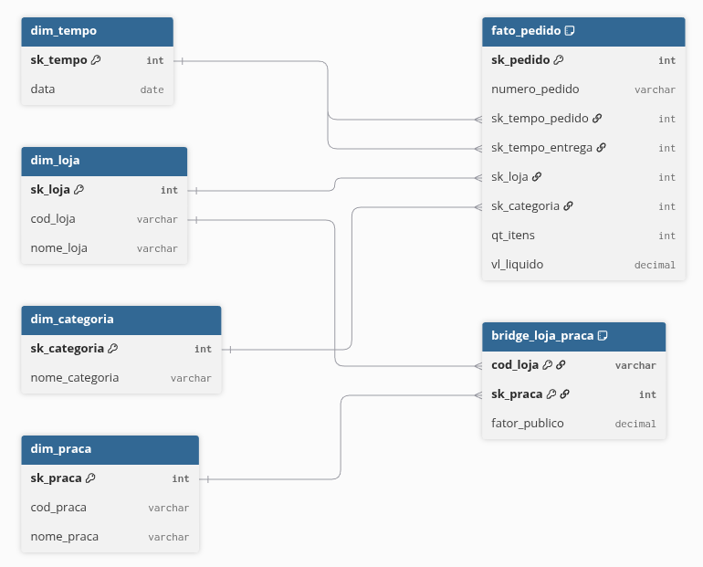

# Como executar o projeto

Execute os scripts SQL na seguinte ordem no seu SGBD:

1. **`01-carga-staging.sql`**: Cria o banco de dados `dw_pata_amiga` e carrega as tabelas brutas da área de staging (`stg_pedido`, `stg_loja`, `stg_loja_praca`).

2. **`02-dimensoes-prontas.sql`**: Cria a estrutura de todas as tabelas do modelo estrela e insere os dados já prontos nas tabelas `dim_tempo` e `dim_loja`.

3. **`03-dimensoes.sql`**: Limpa e carrega os dados nas dimensões faltantes (`dim_categoria`, `dim_praca`) e na tabela de relacionamento (`bridge_loja_praca`).

4. **`04-fato.sql`**: Realiza o tratamento final (ETL) e carrega os 4.044 pedidos na tabela central `fato_pedido`, conectando ela às chaves das dimensões.

5. **`05-perguntas.sql`**: Contém as consultas SQL estruturadas para responder às cinco perguntas de negócio exigidas pela diretoria.

# Apresentação em vídeo

# Contexto do Case

O projeto resolve um problema de integração de dados da Pata Amiga, uma rede catarinense de pet shops. O desafio foi unificar os dados de três sistemas que não se conversam (e-commerce, cadastro de franquias e planilhas de expansão) que possuíam diferentes padrões, para responder a cinco perguntas estratégicas de negócio.

# O Modelo Construído

A solução foi desenhada usando o Modelo Estrela. A tabela fato é fato_pedido com (granularidade de 1 linha = 1 pedido). As tabelas dimensão são: dim_loja, dim_categoria, dim_tempo e dim_praca. Há também a tabeça bridge_loja_praca, para fazer uma ligação entre lojas e praças.

Tratamentos:

O sistema de e-commerce norte-americano enviou as datas em formato estadunidense (MM/DD/AAAA com AM/PM). Utilizamos a máscara %m/%d/%Y %h:%i %p na função STR_TO_DATE para corrigir isso.

Valores financeiros e de quantidade vazios ou com o caractere "-" foram convertidos para NULL, garantindo que não distorcessem o cálculo de médias. O prefixo "R$", pontos de milhar e espaços foram limpos, substituindo a vírgula decimal por ponto.

Na classificação das categorias e dos canais de venda, a ordem lógica do CASE era importante.

A higienização do nome da loja ocorreu antes do JOIN. Utilizamos REPLACE associado a um CASE para resolver três erros de digitação/apelidos específicos, viabilizando o relacionamento com a dimensão.

# Diagnóstico de origem

Grafias distintas de categoria (no MySQL) = 18
Grafias distintas de nome de loja = 50
Grafias distintas de HouveDesconto = 12
Grafias distintas de CanalPedido = 8
Pedidos sem Cod Loja preenchido = 1575
Pedidos sem nome de loja (vao para a -1) = 3

Os quatro marcos em branco = processo em aberto (vão virar dias NULL)

Dt Separacao Estoque = 1077
DtNotaFiscal = 1338
Dt_Despacho_Transportadora = 1665
DtEntregaCliente = 1953

Lista dos nomes de loja distintos:

' Pata Amiga Blumenau Centro'
' Pata Amiga Brusque'
' Pata Amiga Gaspar'
' Pata Amiga Rio do Sul'
'Pata Amiga Ararangua'
'Pata Amiga Blumenal Centro'
'pata amiga blumenau centro'
'Pata Amiga Blumenau Centro/SC'
'Pata Amiga Brusque'
'Pata Amiga Chapecó'
'Pata Amiga Chapeco/SC'
'Pata Amiga Concórdia'
'pata amiga criciuma'
'Pata Amiga Criciuma/SC'
'PATA AMIGA CURITIBANOS'
'Pata Amiga Florianópolis Norte'
'Pata Amiga Florianopolis Norte/SC'
'Pata Amiga Floripa Norte'
'PATA AMIGA GASPAR'
'Pata Amiga Ibirama'
'Pata Amiga Ibirama/SC'
'Pata Amiga Indaial'
'Pata Amiga Itajaí Praia'
'Pata Amiga Itajai Praia/SC'
'PATA AMIGA ITAPOA'
'Pata Amiga Ituporanga'
'Pata Amiga Jaraguá do Sul'
'Pata Amiga Jgua do Sul'
'PATA AMIGA JOINVILLE SUL'
'Pata Amiga Joinville Sul/SC'
'Pata Amiga Lages'
'pata amiga laguna'
'Pata Amiga Laguna/SC'
'Pata Amiga Otacilio  Costa'
'PATA AMIGA OTACILIO COSTA'
'PATA AMIGA PALHOCA'
'Pata Amiga Presidente Getulio'
'Pata Amiga Rio do Sul'
'PATA AMIGA RIO DOS CEDROS'
'Pata Amiga Santo Amaro da Imperatriz'
'Pata Amiga Sao Bento do Sul'
'Pata Amiga São Joaquim'
'Pata Amiga São Jose Kobrasol'
'Pata Amiga Sao Jose Kobrasol/SC'
'Pata Amiga São Miguel do Oeste'
'PATA AMIGA TAIO'
'Pata Amiga Timbo'
'Pata Amiga Tubarão'
'PATA AMIGA XANXERE'

# Categorias padronizadas

Categorias_padronizadas: 8

# Diagrama

# Respostas

## P1: Onde está o gargalo da entrega?

O tempo médio entre o pedido entrar no ERP e chegar na casa do cliente é de 9 dias. O intervalo mais lento é o nota -> despacho, com média de 4,11 dias. O gargalo nos 3 portes de loja é o nota -> despacho, com valores de 8,53 dias, 3,34 dias e 3,32 dias para os portes de loja pequena, média e grande, respectivamente.

## P2: Qual categoria concentra o faturamento?

A seguir a lista do faturamento por categoria e a porcentagem que representa do total:

Racao =	1076202.55 (60.01%)
Medicamento = 305904.03	(17.06%)
Petisco = 128590.16 (7.17%)
Servico = 94001.37 (5.24%)
Higiene = 92314.45 (5.15%)
Acessorio =	64661.39 (3.61%)
Brinquedo =	31634.56 (1.76%)

Ração é a categoria de maior faturamento em todos os portes de loja.

## P3: O desconto funciona igual em todo canal?

A política de descontos é positiva em todos os canais:

App: R$ 488,04 (com desconto) versus R$ 167,63 (sem desconto)
Site: R$ 501,92 (com desconto) versus R$ 189,68 (sem desconto) 
Loja Física: R$ 494,04 (com desconto) versus R$ 197,55 (sem desconto)
WhatsApp: R$ 514,33 (com desconto) versus R$ 179,26 (sem desconto)
Telefone: R$ 514,02 (com desconto) versus R$ 195,23 (sem desconto)

Do faturamento total, app representa 30,79%; site, 25,13%; loja física 20,11%; WhatsApp, 10,52%; telefone, 6,88%; não imformado representa 6,57%.

## P4: Qual praça concentra o faturamento?

A praça "Vale do Itajaí" lidera o faturamento rateado: R$ 633.746,09 para 148.000 domicílios com pet.

## P5: Onde abrir a próxima loja, e o que os dados não permitem afirmar?

a)

Rio dos Cedros possui a maior quantidade de itens por 1000 habitantes: 41,87. Concomitantemente, possui tempo médio de entrega de 14,24 dias (oitavo maior tempo; o maior tempo é de Ituporanga, com 16,53 dias). Assim, é defensável uma nova loja em Rio dos Cendros para atender com mais eficiência a demanda.

b)

Ouro = 1011264.38
Diamante = 382209.74
Prata = 314812.03
Bronze = 84036.06
Nao Informado = 986.30

Como o passado foi sobrescrito, se uma loja era Prata e foi promovida a Ouro, todas as vendas antigas dela aparecerão no seu relatório de hoje como vendas "Ouro". Assim, os dados atuais não permitem afirmar quanto a rede faturou com lojas que já eram Ouro.

c)

Pedidos sem loja identificada: 3
Entregas não concluídas: 1.953
Itens em branco: 257
Valores em branco: 121
